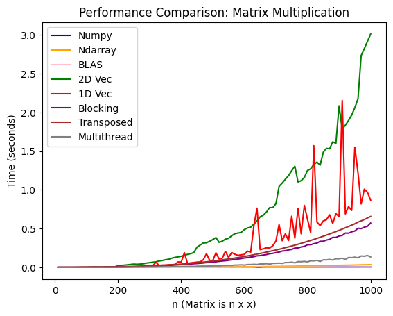
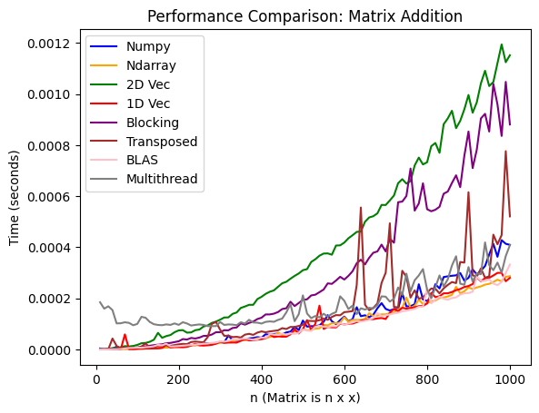
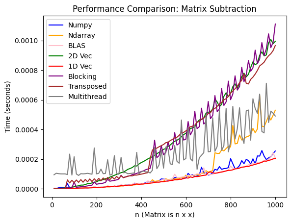
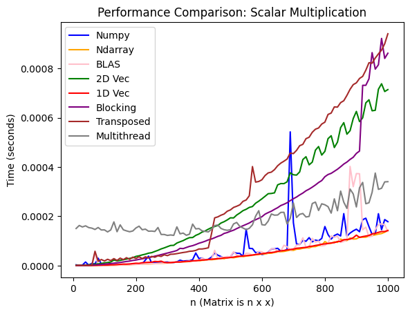

# RMatrix

In this repo, I experimented and benchmarked various implementations of matrix operations in Rust. The operations are matrix multiplication, addition, subtraction, and scalar multiplication.

My goal was to gain some intuition around optimizations, what goes on under the hood, and get an introduction to low-level stuff. There's a lot of room for improvement, but I definitely learned a lot about low-level computing :)

Some additional things to do next include taking a look at BLIS, improve data packing, and trying to create my own version of a hyper optmized micro-kernel (like the [matrixmultiply](https://crates.io/crates/matrixmultiply) crate).

### README Contents:

- [Overview](#overview)
  - [Experimentation Setup](#experimentation-setup)
  - [Repo Organization](#repo-organization)
  - [Matrix Implementations](#matrix-implementations)
- [Analysis](#analysis)
  - [Matrix Multiplication](#matrix-multiplication)
  - [Element-wise Operations](#element-wise-operations)

## Overview

### Experimentation Setup

The machine I was running this on is a Macbook Pro (M4). Note, you will not be able to run this on non Apple machines as the code uses Accelerate (contains Apple's BLAS implementation).

Each implementation was benchmarked against 100 square, double-precision floating-point matrices that were from dimension 10 x 10 to 1000 x 1000 (see [`create_matrices.py`](https://github.com/merrickliu888/RMatrix/blob/main/benches/python_helper/create_matrices.py)). The time for each operation on a matrix was measured as the average of 10 iterations.

### Repo Organization

- `src/` - Source code
  - `matrices/` - Matrix implementations (see [Matrix Implementations](#matrix-implementations) for more details)
- `benches/` - Benchmarking code.
  - `python_helper/`
    - `create_matrices.py` - Generating test matrices
    - `numpy_benchmark.ipynb` - Benchmaking numpy
  - `benchmark.rs` - Rust benchmarking code
  - `benchmarking.rs` - Rust benchmarking utility functions
- `tests/` - Unit tests for each matrix implementation

### Matrix Implementations

A quick overview of the various matrix implementations. The source code for the Rust matrix implementations can be found in [`src/matrices`](https://github.com/merrickliu888/RMatrix/tree/main/src/matrices).

1. **Basic Matrix** (`basic_matrix.rs`)

   - Simple 2D vector-based implementation.
   - Serves as the baseline for performance comparisons.

2. **One-Dimensional Vector Matrix** (`one_d_vec_matrix.rs`)

   - Uses a single vector for storage and stores matrix in row-major order.
   - More memory efficient than 2D vectors
   - Better cache locality.

3. **Transposed View Matrix** (`transposed_view_matrix.rs`)

   - Matrices that contain a transposed / column-major order copy of its data.
   - Useful for optimizing matrix multiplication as better caching for RHS matrix.

4. **Blocked Matrix** (`blocked_matrix.rs`)

   - Implements blocking for matrix multiplication and element wise operations. Optimal block size was 8x8.

5. **Multithread Matrix** (`multithread_matrix.rs`)
   - Parallel implementation. Used 16 threads.
   - For element-wise operations, each thread takes an independent partition of a matrix.
   - For matrix multipliction, each thread takes a block

6. **NDArray Matrix** (`ndarray_matrix.rs`)

   - Wrapper around the [`ndarray`](https://docs.rs/ndarray/latest/ndarray/) crate
   - Leverages [`matrixmultiply`](https://github.com/bluss/matrixmultiply) create under the hood, which does not use BLAS, but instead implements GEMM in a [`BLIS`](https://github.com/flame/blis) inspred way in Rust. See this [blog](https://bluss.github.io/rust/2016/03/28/a-gemmed-rabbit-hole/) post by the creator for more info.

7. **NumPy Matrix** (`numpy_benchmark.ipynb`)

   - Matrices as NumPy ndarrays. Uses BLAS.

8. **BLAS Matrix** (`blas_matrix.rs`)

   - Direct integration with BLAS (Basic Linear Algebra Subprograms) through Apple Accelerate

## Analysis

### Matrix Multiplication

**Findings**

- Implementations perform roughly how I would expect.
- Representing a matrix as a 2D vector being the slowest makes sense as there is poor spatial locality resulting in a lot of potential cache misses, TLB misses, page faults, etc.
- Since we store data in row-major order, the 1D vector representation will result in a lot of cache misses, especially in retrieving columns for the RHS matrix.
- To improve this, the "Transposed" matrix stores a copy of the original matrix, but transposed (column-major order), which does improve performance somewhat.
- To further improve this, blocking / tiling can be used, which we can then combine with multi-threading to squeeze some more performance.
- Ndarray performs faster as it utilzies some highly optimzied micro-kernels. Then finally, NumPy and BLAS implementations perform the fastest and are essentially the same, as they both use BLAS under the hood.

### Element-wise Operations

**Findings**

- All the element-wise operations perform similiarly for the most part (except for the 2d Vec implementation which is expected.)
- Scalar multiplciation seems to be faster which is because its a "simpler computation" ie. fewer memory accesses, better use of registers, etc. See the charts below.
- Multi-threading performs worse than just using a 1D vec. This is due to the overhead associated with threading, along with maintaining cache coherence. The matrices also may be to small to really reap the benefits of multi-threading.
- Blocking is slower than 1D vec. This is because blocking is not beneficial for element-wise operations (as data isn't reused) so it's really just adding extra overhead.

**Matrix Addition**

**Matrix Subtraction**

**Scalar Multiplication**

