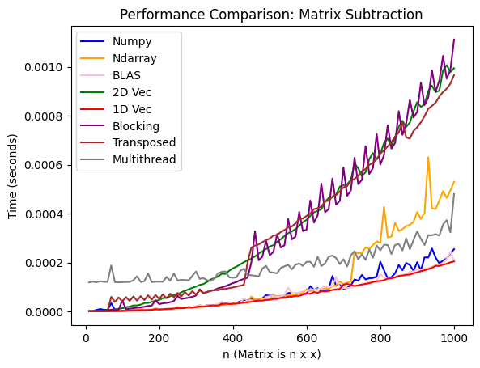

# RMatrix

In this repo, I experimented and benchmarked various implementations of matrix operations in Rust. The operations are matrix multiplication, addition, subtraction, and scalar multiplication.

### README Contents:

- [Overview](#overview)
  - [Experimentation Setup](#experimentation-setup)
  - [Repo Organization](#repo-organization)
  - [Matrix Implementations](#matrix-implementations)
- [Analysis](#analysis)
  - [Matrix Multiplication](#matrix-multiplication)
  - [Element-wise Operations](#element-wise-operations)

## Overview

### Experimenation Setup

The machine I was running this on is a Macbook Pro (M4). Note, you will not be able to run this on non Apple machines as the code uses Accelerate (contains Apple's BLAS implementation).

Each implementation was benchmarked against 100 square, double-precision floating-point matrices that were from dimension 10 x 10 to 1000 x 1000 (see [`create_matrices.py`](https://github.com/merrickliu888/RMatrix/blob/main/benches/python_helper/create_matrices.py)). The time for each operation on a matrix was measured as the average of 10 iterations.

### Repo Organization

- `src/` - Source code
  - `matrices/` - Matrix implementations (see [Matrix Implementations](#matrix-implementations) for more details)
- `benches/` - Benchmarking code.
  - `python_helper/`
    - `create_matrices.py` - Generating test matrices
    - `numpy_benchmark.ipynb` - Benchmaking numpy
  - `benchmark.rs` - Rust benchmarking code
  - `benchmarking.rs` - Rust benchmarking utility functions
- `tests/` - Unit tests for each matrix implementation

### Matrix Implementations

A quick overview of the various matrix implementations. The source code for the Rust matrix implementations can be found in [`src/matrices`](https://github.com/merrickliu888/RMatrix/tree/main/src/matrices).

1. **Basic Matrix** (`basic_matrix.rs`)

   - Simple 2D vector-based implementation
   - Serves as the baseline for performance comparisons

2. **One-Dimensional Vector Matrix** (`one_d_vec_matrix.rs`)

   - Uses a single vector for storage
   - More memory efficient than 2D vectors
   - Better cache locality

3. **NDArray Matrix** (`ndarray_matrix.rs`)

   - Wrapper around the [`ndarray`](https://docs.rs/ndarray/latest/ndarray/) crate
   - Leverages optimized BLAS operations

4. **NumPy Matrix** (`numpy_benchmark.ipynb`)

   - Matrices as NumPy ndarrays.

5. **Transposed View Matrix** (`transposed_view_matrix.rs`)

   - Matrices contain a transposed view of it's data
   - Useful for optimizing matrix multiplication as better caching

6. **BLAS Matrix** (`blas_matrix.rs`)

   - Direct integration with BLAS (Basic Linear Algebra Subprograms) through Apple Accelerate

7. **Blocked Matrix** (`blocked_matrix.rs`)

   - Implements blocking for matrix multiplication and element wise operations.

8. **Multithread Matrix** (`multithread_matrix.rs`)
   - Parallel implementation using Rust's threading.
   - For element-wise operations, each thread takes an independent partition of a matrix.
   - For matrix multipliction, each thread takes a block

## Analysis

### Matrix Multiplication

### Element-wise Operations

**Matrix Addition**

**Matrix Subtraction**

**Scalar Multiplication**

